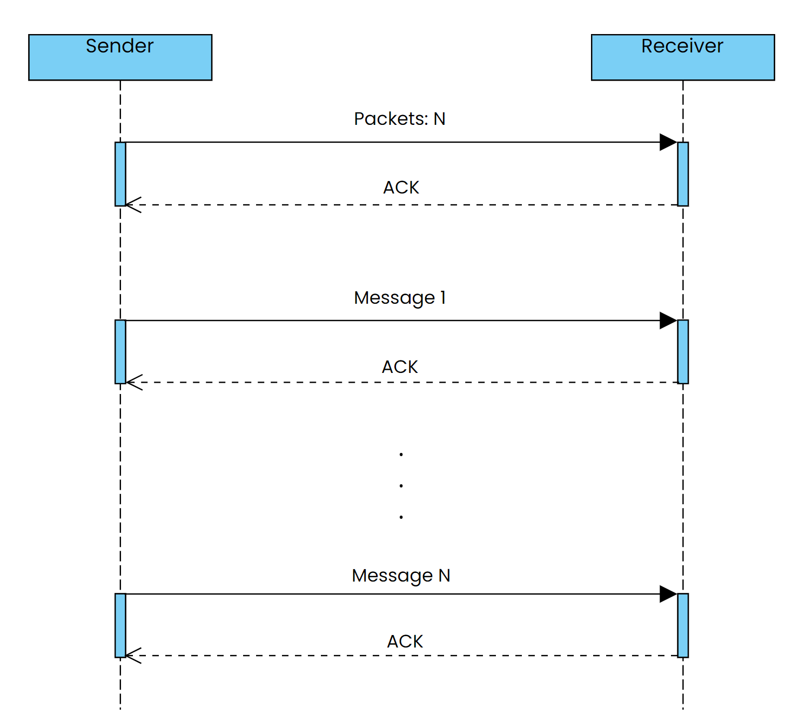

# General Project Description

In this team assignment, we developed our network programming skills.
It was created a client-server system in Java. This system is composed by a Reliable User Datagram Protocol (UDP) and a Transport Control Protocol (TCP) application.
In both protocols created a text anonymizer, where a client sends a string and a keyword to a server for anonymization. The server replaces the keyword with 'X' and returns the anonymized string along with the number of replacements and corresponding "Socket Programming" strings. Error handling mechanisms are crucial, including validating ports, handling unsuccessful connections, and displaying appropriate error messages.
This README file serves as a guide for a better understanding of the project and it´s inner workings.

## UDP

### High-Level Interaction Flow

The UDP client-server interaction follows a stop-and-wait principle for reliability. The essential steps include:

#### Classes involved:

- UDP Client (`client_java_udp`)
- UDP Server (`server_java_udp`)
- Anonymized Service (`anonymize_Service`)

#### Client-Server Initialization:

- UDP Server starts on a specified port.
- UDP Client initializes with a timeout for packet reception.

#### User Inputs:

- Client prompts the user to input server details (name or IP address, port), string, and keyword.

#### Data Validation:

- Validate correctness and format of user inputs.
- Ensure the port is within the valid range (1024 to 49151).

#### Client Sends Data:

- Send the length of the string to the server.
- Divide the string into chunks and send each to the server.
- Implement a retry mechanism for unsuccessful sends.

#### Server Receives and Anonymizes Data:

- Server receives the length of the string from the client.
- Enter a loop to receive string chunks and sends "ACK" for each.

#### Server Sends Anonymized Data Back to Client:

- Anonymize the received data.
- Send the anonymized data back to the client in chunks.
- Client receives each chunk and sends "ACK" for each.

#### Server Sends "Socket Programming":

- Send "Socket Programming" as many times as the anonymized word is found.

#### Final Result Display at Client:

- Client receives the final anonymized string and the count of replacements.
- Display the anonymized string and repeat "Socket Programming" strings (sent by server) as many times as the count of replacements.

#### Cleanup:

- Client closes its DatagramSocket.
- Server side gets free to provide service for another client.

## TCP

### High-Level Interaction Flow

The TCP client-server interaction follows a similar structure, involving the following steps:

#### Classes involved:

- TCP Client (`client_java_tcp`)
- TCP Server (`server_java_tcp`)
- Anonymized Service (`anonymize_Service`)

#### TCP Client Initialization:

- User inputs server address, port, phrase, and keyword.

#### Data Validation:

- Check if inputs are not blank.
- Validate port within the range.

#### Socket Connection:

- Create a socket and attempt to connect to the server.

#### Data Sending:

- Establish input and output streams for communication.
- Combine phrase and keyword into a single string and send it to the server.
- Wait for server responses.

#### Server Responses:

- Receive anonymized string from the server.
- Print the received data.
- Receive from the server "Socket programming" as many times as the anonymized keyword was found.
- Print the received data.
- Receive end of service signal.
- Close input and output streams and the client socket.

#### TCP Server Initialization:

- User inputs the server port.

#### Port Validation:

- Ensure the provided port is within the valid range.

#### Socket Creation:

- Create a server socket and start listening on the specified port.

#### Connection Handling:

- Accept client connection.
- Establish input and output streams for communication.

#### Data Reception and Processing:

- Read data from the client, separate phrase and keyword.
- Anonymize the phrase, count occurrences, and send back responses.

#### Response Sending:

- Send anonymized string to the client.
- Send "Socket programming!!" as many times as the keyword occurs.
- Mark transmission as complete.

#### Connection Closure:

- Close input and output streams and the client socket.

#### Server Continues Listening:

- Server continues listening for new client connections.

## Challenges

### Anonymization Service

- **Ensure efficient and accurate anonymization within the text.**

- **Handle various punctuation marks and spaces at the end of words.**

- **Make it protocol agnostic, adapting it to both UDP and TCP environments.**

All functions involved in this process are thoroughly documented in the code.

### UDP Implementation Challenge

The primary challenge in the UDP project was achieving reliability in an unreliable protocol. The approach involved implementing a reliable communication mechanism over UDP, acknowledging each chunk of data before sending the next one. This ensures the anonymization service operates effectively and reliably in less-than-ideal network conditions.

#### Implementation

The simplified approach includes the following key steps:

- **Acknowledgment Mechanism:**
  Before sending each chunk of data, the client expects an acknowledgment (ACK) from the server. This ensures that the server successfully received the previous chunk before proceeding.

- **Retry Mechanism:**
 To handle potential packet loss or communication issues, a retry mechanism is implemented. If an acknowledgment is not received within a specified timeout period, the client resends the data packet up to three times. 

- **Fragmentation and Reconstruction:**
  If the string is large it must be broken up into segments, “every segment must be ACKed to preserve the stop-n-wait characteristics of the protocol”. The server reconstructs these fragments on the receiving end, ensuring the original message's integrity.

- **Client-Server UDP interaction:**

  

All functions involved in this process are thoroughly documented in the code.

## References

- lmn@isep.ipp.pt - 27/12/2023 - "TCPEchoServer.java" (N/A) Type: source code
- lmn@isep.ipp.pt - 27/12/2023 - "TCPEchoClient.java" (N/A) Type: source code
- Oracle (2023) "Class ServerSocket" [Official Documentation]. Java Platform Standard Edition 8 Documentation.
- Oracle (2023) "Class InputStreamReader" [Official Documentation]. Java Platform Standard Edition 8 Documentation.
- Baeldung (2024) "A Guide to Java String" [Online Guide].
- TutorialsPoint (2021) "Stop and Wait Protocol" [Online Tutorial].
